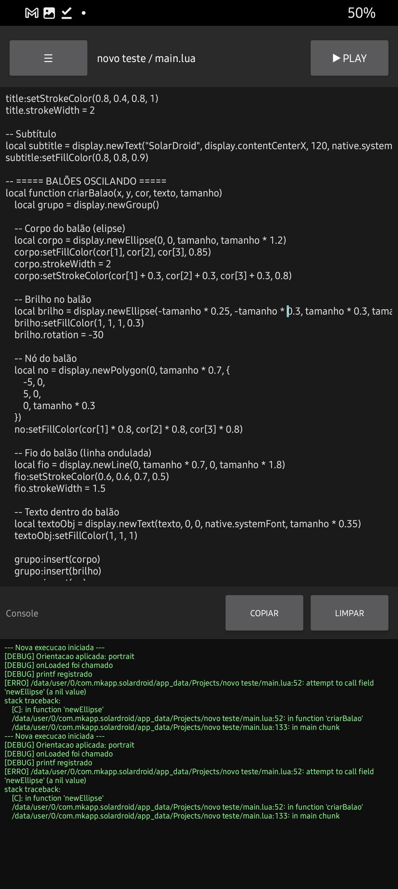
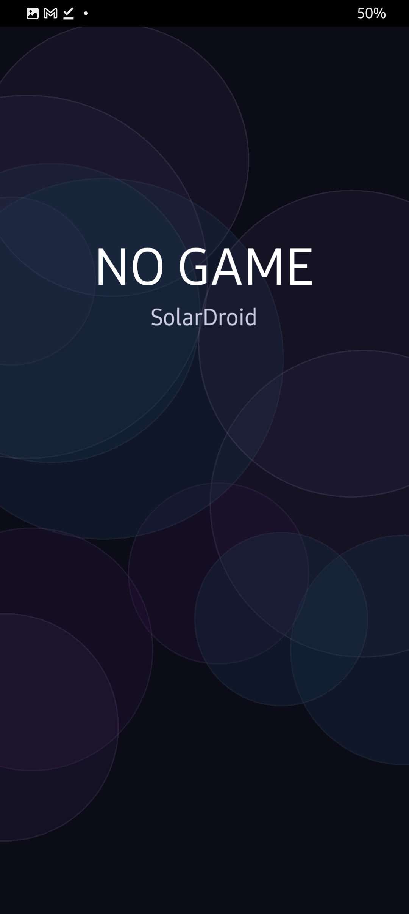
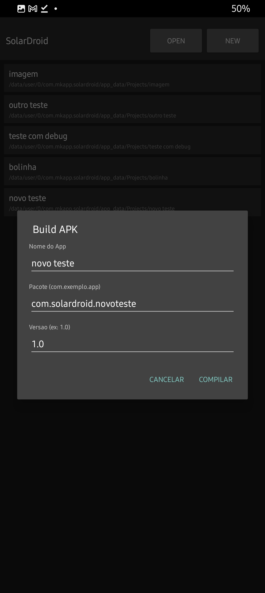
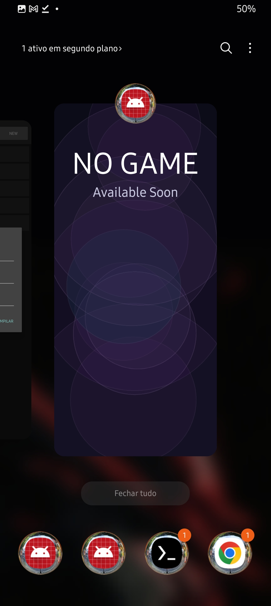

<div align="center">

<!-- 🖼️ PUT YOUR APP ICON HERE -->
<!--  -->

# SolarDroid

**Code, build, and run Corona/Solar2D apps entirely on your Android phone — no PC required.**

[](LICENSE)
[](https://www.android.com/)
[](https://www.java.com/)
[](https://solar2d.com/)
[]()

</div>

---

## 📱 Quick Overview

SolarDroid is a **mobile-first IDE** that brings **Solar2D** development directly to your Android phone. Write, test, compile, and ship apps entirely on your device — no PC needed.

<p align="center">
  
  
  
  
</p>

---

## 📖 Table of Contents

- [About](#-about)
- [What is Solar2D?](#-what-is-solar2d)
- [Features](#-features)
- [System Requirements](#-system-requirements)
- [Getting Started](#-getting-started)
- [Project Structure](#-project-structure)
- [How It Works](#-how-it-works)
- [Built With](#-built-with)
- [Roadmap](#-roadmap)
- [Contributing](#-contributing)
- [License](#-license)
- [Support](#-support)

---

## 💡 About

SolarDroid is a mobile-first development environment for **[Solar2D](https://solar2d.com/)** (formerly Corona SDK) apps, built to run entirely on Android — no computer needed.

It's designed for:
- 👨‍💻 Developers who want to code on the go
- 🌍 People without access to a PC but with an Android device
- ⚡ Those who love fast iteration and instant feedback
- 🎮 Game developers and app creators using Lua

### With SolarDroid you can:
- ✏️ **Write & Edit** Solar2D/Corona code directly on your phone
- ⚡ **Instantly Preview** your project without long compile times
- 📦 **Build APKs** and share them with friends
- 💻 **No PC Required** — do all of this without ever touching a computer
- 🔄 **Hot Reload** — see changes in real-time

**Current Status:** Right now the focus isn't on polishing the UI — it's on squashing bugs and expanding the editor's capabilities. A solid, functional foundation comes first.

---

## 🎮 What is Solar2D?

<div align="center">
  
</div>

**[Solar2D](https://solar2d.com/)** (formerly known as Corona SDK) is an open-source, cross-platform framework for building 2D games and applications using **Lua**.

### Why Solar2D?

| Feature | Benefit |
|---------|---------|
| **Lightweight** | Small file sizes, fast deployment |
| **Lua-based** | Easy to learn, powerful scripting language |
| **Cross-platform** | Build for Android, iOS, Windows, macOS, and more from one codebase |
| **Fast Iteration** | See changes in seconds, not minutes |
| **Built-in Features** | Physics, graphics, networking, and more |
| **Open Source** | Free and community-driven |

### What can you build with Solar2D?

- 🎮 **2D Games** — Casual games, puzzles, platformers, arcade games
- 📱 **Mobile Apps** — Productivity apps, utilities, educational content
- 🎨 **Interactive Content** — Animations, visual experiences, media players

### Solar2D Resources

- 🌐 [Official Website](https://solar2d.com/)
- 📚 [Complete Documentation](https://docs.solar2d.com/)
- 🔧 [API Reference](https://docs.solar2d.com/api/library/)
- 💻 [GitHub Repository](https://github.com/coronalabs/corona)
- 👥 [Community Forum](https://solar2d.com/forums/)
- 🎓 [Tutorials & Guides](https://docs.solar2d.com/tutorials/)

### Getting Started with Solar2D

Before using SolarDroid, it's helpful to understand Solar2D basics:

```lua
-- Example Solar2D/Lua code
local display = require("display")

-- Create a circle
local myCircle = display.newCircle(100, 100, 50)
myCircle:setFillColor(1, 0, 0)  -- Red color (RGB)

-- Add physics
local physics = require("physics")
physics.start()
physics.addBody(myCircle, "dynamic")
```

---

## ✨ Features

### ✅ Current Features (v1.0)

- [x] **Code Editor** — Syntax highlighting and basic editing
- [x] **Console** — Real-time output and debugging
- [x] **Project Manager** — Create and manage multiple projects
- [x] **File Tree** — Navigate project structure easily
- [x] **Preview Screen** — See your app running in real-time
- [x] **APK Compilation** — Build and export APK files

### 📋 Roadmap (Planned Features)

- [ ] **Advanced Code Editor** — Better autocomplete, themes, plugins
- [ ] **Keystore Generator** — Simplified signing process
- [ ] **UI Improvements** — Modern, polished interface
- [ ] **AAB Compiler Support** — Google Play Bundle format
- [ ] **Plugin System** — Extend functionality with plugins
- [ ] **In-depth Documentation** — Comprehensive guides and tutorials
- [ ] **Community Forum** — Discussion board for users
- [ ] **Git Integration** — Built-in version control
- [ ] **Device Testing** — Test on multiple Android devices
- [ ] **Package Manager** — Easy library installation

---

## ⚙️ System Requirements

### Minimum Requirements

- **Android Version:** API 21 (Android 5.0 Lollipop) or higher
- **Target SDK:** Android 14 (API 34)
- **OpenGL ES:** 2.0 or higher
- **RAM:** Minimum 2GB (4GB+ recommended)
- **Storage:** 500MB free space for app + projects

### Recommended

- **Android Version:** API 28+ (Android 9.0 or higher)
- **RAM:** 4GB or more
- **Storage:** 2GB+ free space
- **Processor:** Octa-core or better
- **Screen Size:** 5.5" or larger (for better editing experience)

---

## 🚀 Getting Started

### Prerequisites

To build SolarDroid from source, you'll need:

- [Android Studio](https://developer.android.com/studio) or [Android SDK Tools](https://developer.android.com/tools/releases/cmdline-tools)
- [Java Development Kit (JDK) 8+](https://www.oracle.com/java/technologies/javase-downloads.html)
- [Gradle](https://gradle.org/) (usually bundled with Android Studio)
- Git

### Installation & Build

1. **Clone the repository:**
   ```bash
   git clone https://github.com/Nandazdev2/SolarDroid.git
   cd SolarDroid
   ```

2. **Build the project:**
   ```bash
   ./gradlew build
   ```

3. **Run on Android device or emulator:**
   ```bash
   ./gradlew installDebug
   ```

4. **Launch the app:**
   - Find "SolarDroid" in your Android device's app drawer
   - Tap to launch the IDE

### First Project

Once SolarDroid is installed:

1. Open the app
2. Create a new project
3. Copy a sample Solar2D project (or start coding!)
4. Press "Run" to see your app in the preview
5. Build to APK when ready

---

## 📁 Project Structure

```
SolarDroid/
├── src/
│   └── com/
│       ├── ansca/                    # Solar2D core runtime integration
│       │   ├── CoronaActivity.java
│       │   ├── CoronaEnvironment.java
│       │   └── ...
│       └── mkapp/                    # SolarDroid main application
│           ├── ProjectListActivity.java    # Project list screen
│           ├── EditorActivity.java         # Code editor screen
│           ├── MainActivity.java           # Preview/runtime screen
│           ├── CrashActivity.java          # Crash reporting
│           └── ...
├── res/                              # Android resources
│   ├── layout/                       # UI layouts
│   ├── values/                       # Strings, colors, dimensions
│   ├── drawable/                     # Icons and images
│   └── mipmap/                       # App icons
├── libs/                             # External libraries
│   └── aar-extracted/
│       └── apksig-android-4.1.1/     # APK signing library
├── assets/                           # App assets
├── testproject/                      # Example Solar2D project
├── AndroidManifest.xml              # Android app configuration
├── build.gradle                      # Gradle build configuration
├── mkapp.config                      # Build system configuration
└── lua_as_java.txt                   # Lua/Java integration notes
```

### Key Directories Explained

- **`src/com/ansca/`** — Corona/Solar2D runtime layer (integration between Lua and Android)
- **`src/com/mkapp/`** — SolarDroid-specific UI and editor implementation
- **`res/`** — Android UI resources (layouts, strings, images)
- **`libs/`** — Pre-compiled libraries (APK signing, etc.)
- **`testproject/`** — Sample Solar2D project for testing

---

## ⚙️ How It Works

### Architecture Overview

```
┌─────────────────────────────────────┐
│   SolarDroid UI Layer (Java)        │
│  - Editor Activity                  │
│  - Project Manager                  │
│  - Console                          │
└────────────┬────────────────────────┘
             │
             ▼
┌─────────────────────────────────────┐
│   Solar2D Runtime (Corona/Ansca)    │
│  - Lua Virtual Machine              │
│  - Graphics Engine                  │
│  - Physics Engine                   │
│  - Input Handling                   │
└────────────┬────────────────────────┘
             │
             ▼
┌─────────────────────────────────────┐
│   Android Framework                 │
│  - OpenGL ES 2.0                    │
│  - System Services                  │
│  - Hardware Access                  │
└─────────────────────────────────────┘
```

### Development Flow

1. **Write Code** → Edit Lua code in the SolarDroid editor
2. **Preview** → See changes instantly in the preview window
3. **Debug** → View console output for debugging
4. **Build** → Compile to APK using the build system
5. **Share** → Export and share your APK

### Build System

SolarDroid uses a custom, lightweight build system:
- Optimized for fast, on-device compilation
- No bloated toolchains or long wait times
- Direct Lua to APK compilation
- Integrated APK signing (via APKSig library)

---

## 🛠️ Built With

| Component | Purpose | Version |
|-----------|---------|---------|
| **[Solar2D (Corona SDK)](https://solar2d.com/)** | Lua-based game framework | Latest |
| **[Android SDK](https://developer.android.com/studio)** | Android development toolkit | API 21-34 |
| **Java** | Main language for IDE | JDK 8+ |
| **[APKSig](https://developer.android.com/studio/publish/app-signing)** | APK signing library | 4.1.1 |
| **OpenGL ES** | Graphics rendering | 2.0+ |
| **Gradle** | Build automation | Latest |

---

## 🎯 Use Cases

### 🎮 Game Development
- Build 2D games and prototypes
- Test gameplay mechanics on-device
- Publish to Google Play Store

### 📱 App Development
- Create utility applications
- Build productivity tools
- Develop educational content

### 🎓 Learning
- Learn Lua programming
- Understand game development
- Explore mobile development

### 🔧 Rapid Prototyping
- Quickly test ideas
- Iterate without a PC
- Validate concepts

---

## 🤝 Contributing

We welcome contributions! Whether you're fixing bugs, adding features, or improving documentation, your help is appreciated.

### Ways to Contribute

- **Report Bugs** — [Open an Issue](https://github.com/Nandazdev2/SolarDroid/issues/new?template=bug_report.md)
- **Suggest Features** — [Start a Discussion](https://github.com/Nandazdev2/SolarDroid/discussions)
- **Submit Code** — [Create a Pull Request](https://github.com/Nandazdev2/SolarDroid/pulls)
- **Improve Docs** — Help improve documentation and guides
- **Share Feedback** — Tell us what you think!

**See [CONTRIBUTING.md](CONTRIBUTING.md) for detailed guidelines.**

---

## 📝 License

This project is licensed under the **MIT License** — see the [LICENSE](LICENSE) file for details.

```
MIT License

Copyright (c) 2026 Nandazdev2

Permission is hereby granted, free of charge, to any person obtaining a copy
of this software and associated documentation files (the "Software"), to deal
in the Software without restriction, including without limitation the rights
to use, copy, modify, merge, publish, distribute, sublicense, and/or sell
copies of the Software...
```

---

## 🆘 Support & Community

### Getting Help

- 📖 **Read the Docs** — Check [Solar2D Documentation](https://docs.solar2d.com/)
- 🐛 **Report a Bug** — [GitHub Issues](https://github.com/Nandazdev2/SolarDroid/issues)
- 💬 **Ask a Question** — [GitHub Discussions](https://github.com/Nandazdev2/SolarDroid/discussions)
- 🌐 **Visit Forums** — [Solar2D Community Forum](https://solar2d.com/forums/)

### Useful Links

| Resource | Description |
|----------|-------------|
| [Solar2D Website](https://solar2d.com/) | Official Solar2D home |
| [Solar2D Docs](https://docs.solar2d.com/) | Complete documentation |
| [Solar2D API](https://docs.solar2d.com/api/library/) | API reference |
| [Solar2D GitHub](https://github.com/coronalabs/corona) | Corona open source |
| [Android Docs](https://developer.android.com/guide) | Android development guide |
| [Lua Manual](https://www.lua.org/manual/) | Lua programming reference |

---

## 📊 Project Stats

- **Language:** Java, Lua
- **Platform:** Android 5.0+
- **License:** MIT
- **Status:** Active Development 🚀
- **Last Updated:** July 2026

---

## 🙏 Acknowledgments

- **[Solar2D/Corona Labs](https://solar2d.com/)** — For the incredible open-source Lua framework
- **[Android Open Source Project](https://source.android.com/)** — For the Android platform
- **[Google](https://developers.google.com/)** — For Android SDK and development tools
- **Community** — For feedback and support

---

<div align="center">

**Made with ❤️ for developers who love coding on the go**

[⭐ Star us on GitHub](https://github.com/Nandazdev2/SolarDroid) • [🐛 Report a Bug](https://github.com/Nandazdev2/SolarDroid/issues) • [💡 Suggest a Feature](https://github.com/Nandazdev2/SolarDroid/discussions)

</div>
